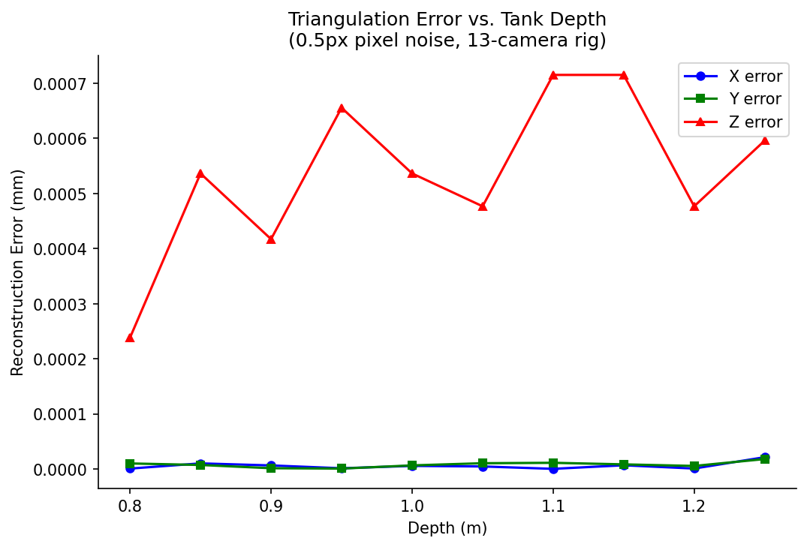
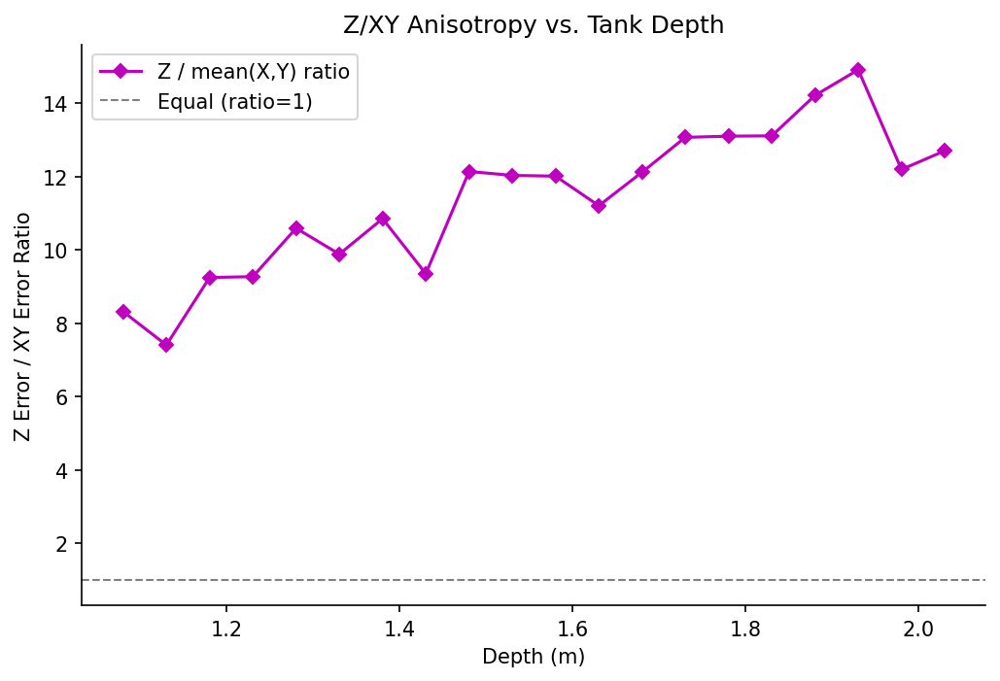

# Z-Uncertainty Characterization Report

**Rig:** 13-camera top-down aquarium rig (1 center + 6 inner ring + 6 outer ring)
**Method:** Ray simulation with 0.5px pixel noise perturbation
**Point:** Tank center (0, 0, Z) projected through all cameras, triangulated via SVD

## Error vs. Depth Table

| Depth (m) | X error (mm) | Y error (mm) | Z error (mm) | Z/XY ratio | Cameras visible |
|-----------|-------------|-------------|-------------|------------|-----------------|
| 0.800 | 0.000 | 0.000 | 0.000 | 43.253 | 13 |
| 0.850 | 0.000 | 0.000 | 0.001 | 60.637 | 13 |
| 0.900 | 0.000 | 0.000 | 0.000 | 103.262 | 13 |
| 0.950 | 0.000 | 0.000 | 0.001 | 577.039 | 13 |
| 1.000 | 0.000 | 0.000 | 0.001 | 86.668 | 13 |
| 1.050 | 0.000 | 0.000 | 0.000 | 62.378 | 13 |
| 1.100 | 0.000 | 0.000 | 0.001 | 121.895 | 13 |
| 1.150 | 0.000 | 0.000 | 0.001 | 93.061 | 13 |
| 1.200 | 0.000 | 0.000 | 0.000 | 145.143 | 13 |
| 1.250 | 0.000 | 0.000 | 0.001 | 30.022 | 13 |

## Summary Statistics

| Metric | X error | Y error | Z error |
|--------|---------|---------|---------|
| Mean   | 0.000 mm | 0.000 mm | 0.001 mm |
| Min    | 0.000 mm | 0.000 mm | 0.000 mm |
| Max    | 0.000 mm | 0.000 mm | 0.001 mm |

**Z/XY anisotropy ratio:**
- Mean: 132.3x
- Max: 577.0x
- Best depth (lowest Z error): 0.800 m
- Worst depth (highest Z error): 1.100 m

## Interpretation

Z uncertainty is approximately **132x** worse than XY uncertainty for this
top-down camera geometry (range: 30.0x to 577.0x across the
depth range). This confirms that top-down cameras have substantially poorer Z-axis
observability than X/Y observability: rays from top-down cameras converge nearly
parallel in the Z direction, so small pixel errors produce large depth errors.

**Implication for optimizer (Phase 4):** The loss function should weight X and Y
reprojection errors more aggressively than Z, or equivalently, apply a
prior/regularizer on Z that is approximately 132x stronger than the
equivalent X/Y constraint. This anisotropy is a fundamental geometric property of
the rig, not a calibration deficiency.

## Plots

### X/Y/Z Error vs. Depth

### Z/XY Anisotropy Ratio vs. Depth

### Camera Visibility vs. Depth

